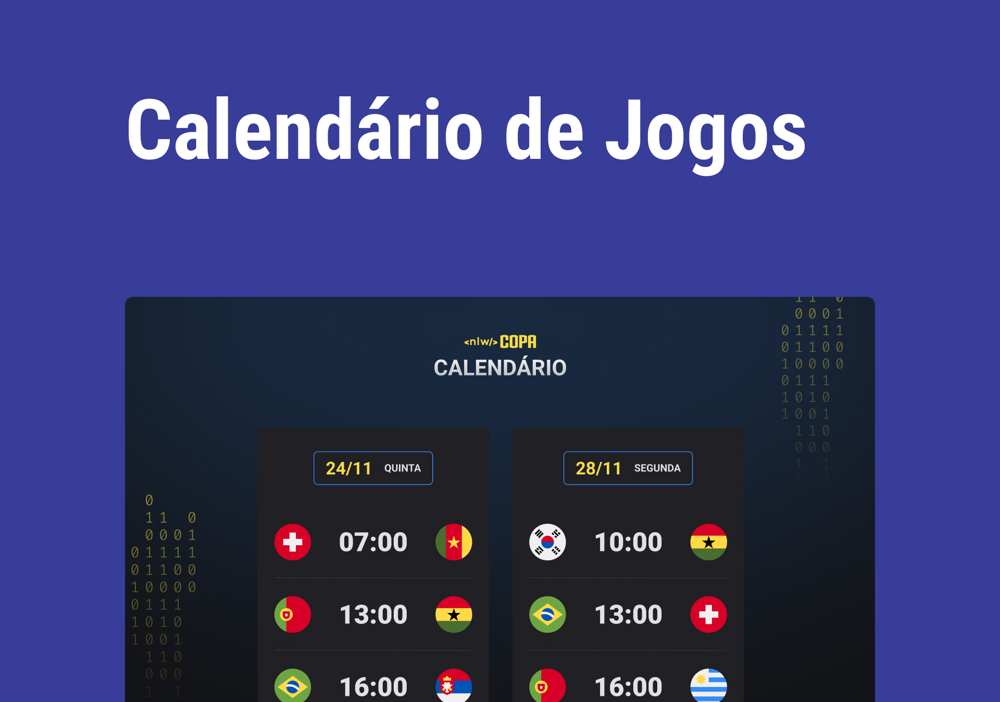

<h1 align="center"> Calendário Copa do Mundo 2022 </h1>

<p align="center">
Calendário dos jogos da Copa do Mundo de 2022.
</p>

<p align="center">
  <a href="#-tecnologias">Tecnologias</a>&nbsp;&nbsp;&nbsp;|&nbsp;&nbsp;&nbsp;
  <a href="#-projeto">Projeto</a>&nbsp;&nbsp;&nbsp;|&nbsp;&nbsp;&nbsp;
  <a href="#-layout">Layout</a>&nbsp;&nbsp;&nbsp;|&nbsp;&nbsp;&nbsp;
  [HTML](#-skull-html)&nbsp;&nbsp;&nbsp;|&nbsp;&nbsp;&nbsp;
  [CSS](#-woman-lipstick-css)&nbsp;&nbsp;&nbsp;|&nbsp;&nbsp;&nbsp;
  [JavaScript](#-woman_dancing-javascript)&nbsp;&nbsp;&nbsp;|&nbsp;&nbsp;&nbsp;
  [Git](#shipit-git) &nbsp;&nbsp;&nbsp;|&nbsp;&nbsp;&nbsp;
  <a href="#memo-licença">Licença</a>
</p>

<p align="center">
  
</p>

<br>

<p align="center">
  
</p>

## 🚀 Tecnologias
</br>

Esse projeto foi desenvolvido com as seguintes tecnologias:

</br>

- HTML e CSS;
- JavaScript;
- [Node.Js](https://nodejs.org/)
- [Git](https://git-scm.com/) e GitHub.

</br>

## 💻 Projeto

</br>

O Calendário da Copa é um projeto que mostra o calendário dos jogos da Copa do Mundo de 2022, desenvolvido durante NLW-Copa da Rocketseat.

</br>

## 🔖 Layout

</br>

Você pode visualizar o layout do projeto através [DESSE LINK](https://www.figma.com/community/file/1169028052212317700). É necessário ter conta no [Figma](https://figma.com) para acessá-lo.

</br>

---

<a id="html"></a>

## :skull: HTML
---
### O que é HTML?

</br>

- Estruturar textos, criar links, imagens, vídeo, etc ...
- Hypertext Markup Language (Linguagem de marcação de texto) 
  
</br>

### Hypertext
- Hipertexto
- Texto que contém links

</br>

### Mark
- Marcação do texto
- Elemento HTML ou **`tag`**
    Existem inúmeras tags e cada uma deles irá servir para um determinado propósito. Ex.: imagem, texto grande, link, parágrafo, etc...

</br>

### Sintaxe de uma tag

</br>

Como escrevemos tags HTML?
```html
<p>conteúdo</p>
<!-- Aqui vem um comentário -->
```

</br>

### Atributos

</br>

Adicionam informações e/ou configurações à uma tag
Como escrevemos atributos?
```html
<a href="<https://rocketseat.com.br>">Ver site</a>

```

---

## :woman: :lipstick: CSS
---
### O que é CSS?

</br>

- Estilos para o HTML
- Cascading Style Sheets (Folha de Estilo em Cascata)
    
- Apresentação visual para o cliente

</br>

### Declaration

</br>

- **Declaração**   
    Pedaço de código que irá ditar as propriedades e valores a serem aplicadas a um elemento HTML
    
- Como escrevemos ? 

```css
body {
  background: black;
	/* color: green; Essa linha será ignorada */
}
```

</br>

### Cascading

- Cascata   
    Quando há 2 (ou mais) declarações a última será mais relevante

```css
body {
  background: red;
}

body {
  background: blue;
}
```

</br>

---

## :woman_dancing: Javascript
---
### **O que é?**

</br>

- Linguagem de programação    
    Interpretada e executada pelos navegadores
    
- A inteligência da tríade   
    HTML é a estrutura, CSS é beleza e JS é a inteligência
    
- Não é JAVA    
    Apesar do nome ser semelhante, são linguagens diferentes
    
</br>

### Instruções e sintaxe

</br>

Toda linguagem é escrita com esses 2 princípios

- **Instruções** (declarações)
    
    Ordens ao computador
    
- **Sintaxe**
    
    Maneira correta de escrever
    

```jsx
alert("Olá, Mundo!") // Olá, Mundo!

alert((10 * 100) + " abraços")
// 1000 abraços !

```

</br>

<aside> 💡 Existem `palavras reservadas` da linguagem. Elas são responsáveis em dar significado a diversas instruções.

</aside>

</br>

### **Executando JavaScript**

</br>

Podemos executar diretamente no Navegador

- Ferramenta `DevTools`
    
    Apertando o atalho `F12` no seu teclado
    
- Plataformas online
    
    fronteditor.dev [codepen.io](http://codepen.io/)
    
- Projeto local
    
    Arquivos no computador
    
</br>

### Executando no computador

```html
<!-- em um arquivo index.html -->

<!-- executa js direto no arquivo .html -->

<script>alert('Olá!')</script>

<!-- importa um arquivo .js no seu .html -->

<script src="./script.js"></script>

```

</br>

### Variáveis

</br>

Uma caixinha onde guardamos um tipo de dado para usar mais tarde.

</br>

### Tipos de dados

</br>

Informações que podem ser em `textos`, `números`, `booleanos` (valores lógicos: verdadeiro ou falso) ou dados mais `estruturados`

</br>

### Variáveis e Tipos de dados

```jsx
// declaro e atribuo valor
let boasVindas = "Fala, Dev!";
boasVindas = "Fala, Dev! Beleza?!"

// constante não pode mudar o valor
const serHumano = true;
serHumano = false // Erro!

```

```jsx
// String
""
''
``

// Number
1
1.2

// Boolean
true
false

```

</br>

### Funções

</br>

- Agrupamento de código
- Reuso de código
- Mini programas dentro do programa maior
- Toda linguagem oferece muitas opções

```jsx
// usando uma função
alert('Olá, Mundo!')

// criando uma função
function alert(text) {
	return text
}

```

</br>

### Objetos

</br>

- Atributos
    
    São as propriedades de um objeto
    
- Métodos
    
    São as funcionalidades de um objeto
    

```jsx
// criando um objeto
const person = {
	age: 18,
	drive: function() {}
}

// usando um objeto
person.drive()

```

---


## :shipit: Git

</br>

- Controle de versão
    
    Histórico do projeto
    
- Linha do tempo

</br>

### Conceitos básicos

</br>

- Repository

    Local onde ficará o histórico do seu projeto
    
- Branch
    
    Linha do tempo
    
- Commit
    
    Pontos na história
    
- Stage
    
    Preparação do que será enviado para o ponto na história
    
</br>

### Comandos

</br>

```
// inicia o git (repositório) no seu projeto
git init

// adiciona todos os arquivos modificados, ao stage
git add .

// cria e descreve um ponto na história
git commit -m "message here"

// envia alterações para o repositório remoto
git push

```

</br>

---

## :memo: Licença

Esse projeto está sob a licença MIT.

---
<p align="center">
Feito com ♥ by Vanessa :vulcan_salute:
</p>